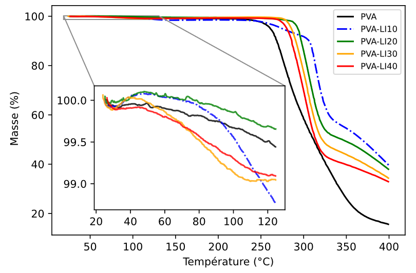

# 🌡️ PVA Thermal Stability Analysis

## 📌 Project Overview

This project analyzes thermogravimetric analysis (TGA) data to evaluate the thermal behavior of Polyvinyl Alcohol (PVA) containing different concentrations of ionic liquid.

Experimental data is processed using Python and Pandas to compare the mass loss profiles of five formulations:

- PVA
- PVA-LI10
- PVA-LI20
- PVA-LI30
- PVA-LI40

The analysis provides a visual comparison of how the incorporation of ionic liquid influences the thermal degradation behavior of PVA.

## 🛠️ Tools & Technologies

- **Python**
- **Pandas** — experimental data import and manipulation
- **NumPy** — numerical computing
- **Matplotlib** — scientific data visualization
- **Excel** — experimental data source

## 🔎 Analysis Workflow

1. Import experimental TGA data from Excel using Pandas.
2. Extract temperature and mass measurements for each PVA formulation.
3. Compare the five experimental samples across the temperature range.
4. Visualize mass loss as a function of temperature.
5. Include a zoomed region to provide additional detail on the initial thermal behavior.

## 📊 TGA Visualization

The following visualization compares the thermogravimetric profiles of PVA and PVA containing different ionic liquid concentrations.

The main graph shows the evolution of remaining mass with increasing temperature, while the inset provides a closer view of the initial region of the experimental curves.

## 💡 Skills Demonstrated

- Experimental Data Analysis
- Python for Data Analysis
- Pandas
- NumPy
- Data Import from Excel
- Matplotlib
- Scientific Data Visualization
- Multi-Series Data Comparison
- Thermogravimetric Analysis (TGA)
- Chemical Engineering Applications

## 📁 Project Files

- `pva_thermal_stability_analysis.py` — Python script for processing and visualizing the TGA data.
- `pva_tga_data.xlsx` — Experimental thermogravimetric dataset.
- `pva-thermal-stability-analysis.png` — Final TGA visualization.

## 👤 Author

**Juan Alejandro Bencosme Diaz**

Data Analyst | Power BI | Python | Chemical Engineering Background
